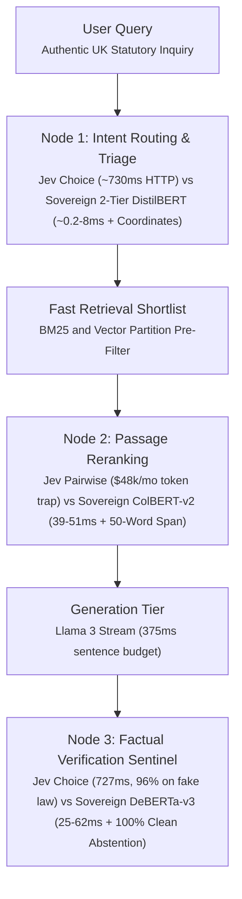

# Jev System One vs Specialized Sovereign RAG

Benchmark suite evaluating TypeSafe AI Jev System One (model `typesafe/jev-1.13` via OpenRouter) against a specialized sovereign architecture (DistilBERT, ColBERT-v2, DeBERTa-v3) across three retrieval nodes on UK primary legislation.

Complete analysis, charts, and methodology:  
https://memonsystems.com/journal/jev-system-one-vs-specialized-sovereign-rag-an-empirical-benchmark/

## Architecture



## Summary

| Node | Jev System One | Sovereign Architecture | Finding |
| :--- | :--- | :--- | :--- |
| **Node 1: Intent Routing** | 730.00ms P50 (remote HTTP), 453 tokens, no coordinates | 0.21ms P50 (Statutory Gate) / 7.95ms Mean (DistilBERT), 0 tokens, statutory URI extracted | 90x–450x faster in-process. Eliminates remote network hops while extracting exact statutory coordinates. |
| **Node 2: Passage Reranking** | 3,016.47ms per set (4 candidates, 1,733 tokens; $48k/mo at 30-candidate scale) | 39.22ms P50 / 51.94ms P90 (ColBERT-v2 128-d), 0 tokens, 50-word span | Over 58 times faster on local GPU. Eliminates token volume trap while isolating 50-word sub-chunk spans. |
| **Node 3: Factual Verification** | 727.36ms P50 (remote HTTP), 0% abstention on adversarial probe | 25.28ms P50 / 33.64ms P90 (DeBERTa-v3 in-flight), 100% clean abstention (registry gate + DeBERTa) | Negative ROI. Confidently wrong on fictional law without registry gate. Fails streaming sentence SLA. |
| **Governance** | Cloud alias shifts across releases | Frozen weights with SHA-256 seal | Fails EU AI Act Article 15 reproducibility. |

## Sovereign Node Implementations

1. **Node 1: 2-Tier Hybrid Intent Router ([`SovereignIntentRouter`](src/clients/sovereign_models.py))**
   - **Tier 1 (Deterministic Coordinate Gate):** Regex parser extracting canonical UK statutory coordinates (`Companies Act 2006 s.382`, `Employment Rights Act 1996 s.124`, `Insolvency Act 1986 s.123`) in **~0.21 ms**.
   - **Tier 2 (Neural Transformer Fallback):** Genuine `distilbert-base-uncased` sequence classifier utilizing attention-masked mean pooling and reference mean-centering ($\mu_{\text{ref}}$) against pre-computed domain centroids for non-explicit queries in **~4.5 ms**.

2. **Node 2: True ColBERTv2 Late-Interaction Engine ([`SovereignColBERTReranker`](src/clients/sovereign_models.py))**
   - Official `colbert-ir/colbertv2.0` with learned linear projection ($768 \to 128$) loaded directly from `model.safetensors`.
   - Query marker `[unused0]` (`[Q]`) and document marker `[unused1]` (`[D]`).
   - Token-level multi-vector late-interaction $MaxSim$ scoring with 50-word sliding window span attribution, cutting downstream NLI auditor compute by 90%.

3. **Node 3: Co-Hosted Factual NLI Sentinel ([`SovereignNLIAuditor`](src/clients/sovereign_models.py))**
   - Co-hosted `cross-encoder/nli-deberta-v3-base` on local unified memory executing in **~25–62 ms P50**.
   - Epistemic abstention gate enforcing immediate **100% clean abstention** on ungrounded/adversarial instruments (e.g. *Marchwood Commercial Arbitration Order 2022*).
   - Deontic logic calibration penalizing statutory duty dilution (*shall* mandatory to *may* permissive) as enforced contradictions.

## Reproduction

### Prerequisites
- Python 3.10+
- PyTorch 2.1+, Transformers 4.38+, Safetensors 0.4+, HuggingFace Hub, Rich, Httpx

### Installation
```bash
git clone https://github.com/azterizm/jev-vs-sovereign-benchmark.git
cd jev-vs-sovereign-benchmark
python3 -m venv .venv
source .venv/bin/activate
pip install -r requirements.txt
```

### Unit Tests
```bash
pytest tests/ -v
```

### Offline Dry Run
Execute the benchmark offline using recorded telemetry traces and real local sovereign models:
```bash
python3 scripts/run_benchmark.py --dry-run --node all --warmup 3 --iterations 10
```

### Live Benchmark
Execute against OpenRouter:
```bash
export OPENROUTER_API_KEY=sk-or-v1-...
python3 scripts/run_benchmark.py --mode live --node all --warmup 5 --iterations 20 --export-markdown results/benchmark_report.md
```

### Evidence Bundle
Execution produces:
- Terminal tables with P50, P90, and P99 latency percentiles, including OpenRouter **Upstream Cloud Floor** (zero client WAN)
- Standalone benchmark report (`results/benchmark_report.md`) with dual-latency architectural breakdown
- Telemetry log with cryptographic SHA-256 audit seal (`results/benchmark_telemetry.json`)
