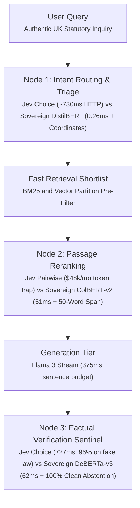

# Jev System One vs Specialized Sovereign RAG

Benchmark suite evaluating TypeSafe AI Jev System One (model `typesafe/jev-1.13` via OpenRouter) against a specialized sovereign architecture (DistilBERT, ColBERT-v2, DeBERTa-v3) across three retrieval nodes on UK primary legislation.

Complete analysis, charts, and methodology:  
https://memonsystems.com/journal/jev-system-one-vs-specialized-sovereign-rag-an-empirical-benchmark/

## Architecture



## Summary

| Node | Jev System One | Sovereign Architecture | Finding |
| :--- | :--- | :--- | :--- |
| Intent Routing | 730.00ms P50, 453 tokens, no coordinates | 0.26ms P50, 0 tokens, statutory URI extracted | Over 2,800 times slower. No entity extraction. |
| Passage Reranking | 3,016.47ms per set, 1,733 tokens | 51.63ms per set, 0 tokens, 50-word span | Over 58 times slower. Token cost inversion at scale. |
| Factual Verification | 727.36ms P50, 0% abstention on fabrications | 62.03ms P50, 100% clean abstention | Confidently wrong on fictional law. Fails streaming SLA. |
| Governance | Cloud alias shifts across releases | Frozen weights with SHA-256 seal | Fails EU AI Act Article 15 reproducibility. |

## Reproduction

### Prerequisites
- Python 3.10+
- PyTorch 2.1+, Transformers 4.38+, Rich, Httpx

### Installation
```bash
git clone https://github.com/azterizm/jev-vs-sovereign-benchmark.git
cd jev-vs-sovereign-benchmark
python3 -m venv .venv
source .venv/bin/activate
pip install -r requirements.txt
```

### Unit Tests
```bash
pytest tests/ -v
```

### Offline Dry Run
Execute the benchmark offline using recorded telemetry traces:
```bash
python3 scripts/run_benchmark.py --dry-run --node all --warmup 2 --iterations 5
```

### Live Benchmark
Execute against OpenRouter:
```bash
export OPENROUTER_API_KEY=sk-or-v1-...
python3 scripts/run_benchmark.py --mode live --node all --warmup 5 --iterations 20 --export-markdown results/benchmark_report.md
```

### Evidence Bundle
Execution produces:
- Terminal tables with P50, P90, and P99 latency percentiles
- Standalone benchmark report (`results/benchmark_report.md`)
- Telemetry log with cryptographic SHA-256 audit seal (`results/benchmark_telemetry.json`)
